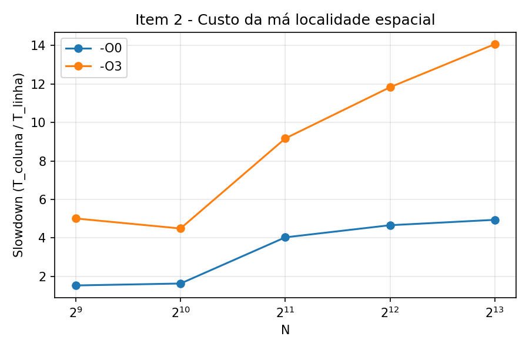
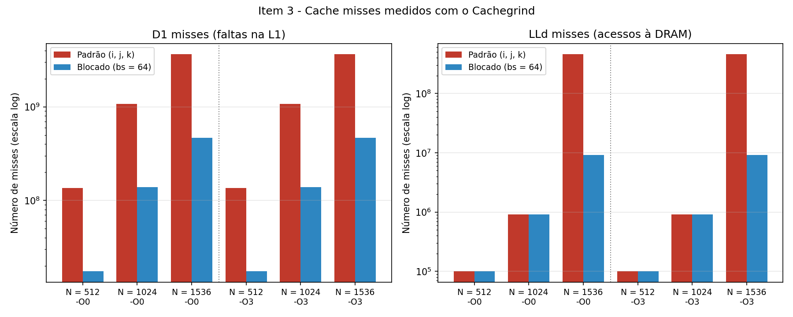
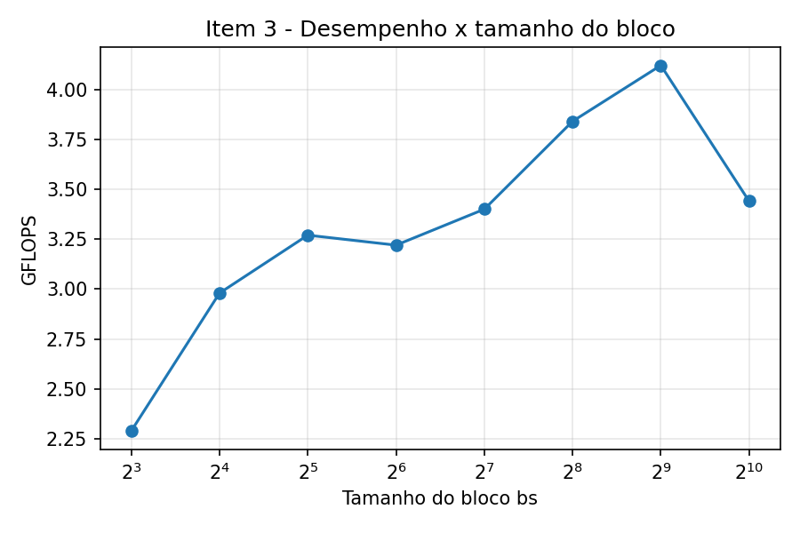
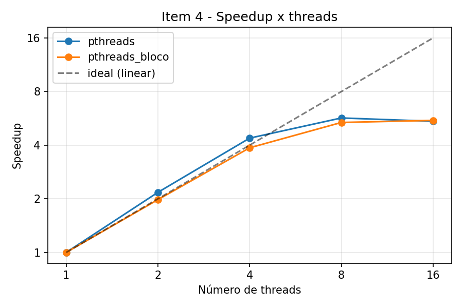

# CompPar: Hierarquia de Memória, Otimizações de Cache e Pthreads

**Curso:** [PREENCHER] — **Disciplina:** Computação Paralela

**Aluno:** Diego Teruya — **RA:** 10723404

**Data de submissão:** 27/09/2026

**Repositório:** https://github.com/[PREENCHER]

---

## 1. Introdução e Fundamentos Teóricos

O desempenho de programas numéricos modernos é limitado, na maioria dos casos, pela hierarquia de memória e não pela capacidade aritmética da CPU (*Memory Wall*). Registradores são acessados em menos de 1 ciclo; a L1 (SRAM, dezenas de KiB por núcleo) custa ~4 ciclos; a L2 (centenas de KiB) ~12 ciclos; a L3 compartilhada (vários MiB) ~40 ciclos; e a DRAM de 100 a 300 ciclos.

Os caches exploram dois princípios. **Localidade temporal**: um dado acessado tende a ser acessado de novo em breve. **Localidade espacial**: dados vizinhos tendem a ser acessados em seguida. A unidade de transferência é a **linha de cache** (64 bytes): um miss traz 64 bytes contíguos, ou seja, 8 `double` ou 16 `int`.

Em C, matrizes são armazenadas em **Row-Major**: A[i][j] fica em `A + (i·N + j)·sizeof(tipo)`. Percorrer por linha aproveita toda a linha de cache carregada; percorrer por coluna salta N·8 bytes a cada acesso.

A **blocagem (tiling)** reorganiza o cálculo em sub-blocos bs × bs pequenos o suficiente para permanecerem no cache enquanto são reutilizados, convertendo reuso "distante" (atendido pela DRAM) em reuso "próximo" (atendido pela L1/L2/L3).

O **Pthreads** (POSIX Threads) permite paralelismo em memória compartilhada: várias threads no mesmo espaço de endereçamento, cada uma em um núcleo. O desempenho depende de dividir o trabalho sem contenção e sem *false sharing*.

## 2. Metodologia e Caracterização do Hardware

| Item | Valor |
|---|---|
| Máquina | Lenovo IdeaPad Gaming 3 15IMH05 |
| CPU (modelo) | [PREENCHER — linha "Model name" de results/hardware.txt] |
| Frequência base / turbo | [PREENCHER] |
| Núcleos físicos / lógicos | [PREENCHER] / 12 (`nproc`) |
| L1d (por núcleo) | 32 KiB, 8-way, linha de 64 B |
| L1i (por núcleo) | 32 KiB, 8-way, linha de 64 B |
| L2 (por núcleo) | 256 KiB, 4-way, linha de 64 B |
| L3 (compartilhada) | 12 MiB (12288 KiB), 16-way, linha de 64 B |
| Linha de cache | 64 bytes |
| RAM (capacidade, tipo, velocidade) | [PREENCHER — results/ram.txt] |
| SO / kernel | [PREENCHER] |
| GCC | [PREENCHER] |
| Valgrind | 3.18.1 |

**Compilação:** `gcc -O0 -Wall -Wextra -std=c11` e `gcc -O3 -Wall -Wextra -std=c11`, com `-pthread` (via `make`). Nenhum aviso foi emitido.

**Medição:** `clock_gettime(CLOCK_MONOTONIC)`, medindo apenas o núcleo do cálculo (sem alocação e inicialização). No Item 2, cada ponto é o **mínimo de 5 repetições**. Matrizes alocadas em um único bloco contíguo alinhado a 64 bytes (`posix_memalign`). Todos os experimentos foram executados pelo script `run_experiments.sh` com `CG_SIZES="512 1024 1536"`.

**Profiling:** `valgrind --tool=cachegrind --cache-sim=yes ./programa N [bs]`. O Cachegrind simula uma hierarquia de dois níveis (L1 e LL). Ele usou a L3 da máquina como LL e ajustou a associatividade simulada de 16 para 24 vias, mantendo os 12 MiB (aviso exibido na execução).

**Integridade:** todo produto é comparado elemento a elemento com a forma fechada C[i][j] = j·(i·S1 + S2), com S1 = Σk e S2 = Σk². Todas as execuções exibiram `Verificação: OK`.

**Escolha do bloco:** pela condição 3·bs²·8 ≤ capacidade, a L1d de 32 KiB dá bs ≤ 36 (potência de 2: 32), a L2 de 256 KiB dá bs ≤ 103 (64) e a L3 de 12 MiB dá bs ≤ 724 (512). Usei bs = 64 (alvo L2) nos Itens 3 e 4 e fiz uma varredura de bs de 8 a 1024 para verificar empiricamente (Seção 4).

## 3. Evidências Experimentais

**Figura 1 – Compilação de todos os programas sem avisos (`make clean && make`).**

[COLE AQUI O PRINT DA COMPILAÇÃO]

**Figura 2 – Item 2: varredura por linha e por coluna (mesma contagem de pares, tempos diferentes).**

[COLE AQUI O PRINT DE `cat results/item2_log.txt`]

**Figura 3 – Item 3: multiplicação padrão e blocada sob -O0 e -O3.**

[COLE AQUI O PRINT DE `cat results/item3_log.txt`]

**Figura 4 – Cachegrind, versão padrão (-O3, N = 1536).**

[COLE AQUI O PRINT DE `cat results/cachegrind_padrao_O3_1536.txt`]

**Figura 5 – Cachegrind, versão blocada (-O3, N = 1536).**

[COLE AQUI O PRINT DE `cat results/cachegrind_bloco_O3_1536.txt`]

**Figura 6 – Item 4: execução com 1, 2, 4, 8 e 16 threads, todas com `Verificação: OK`.**

[COLE AQUI O PRINT DE `cat results/item4_log.txt`]

## 4. Tabelas Comparativas e Gráficos

### Tabela 1 – Item 2: varredura linha × coluna (mínimo de 5 repetições)

| Otimização | N | T_linha (s) | T_coluna (s) | Slowdown (T_col/T_lin) |
|---|---|---|---|---|
| -O0 | 512 | 0.000726 | 0.001112 | 1.53× |
| -O0 | 1024 | 0.003071 | 0.005017 | 1.63× |
| -O0 | 2048 | 0.012103 | 0.048758 | 4.03× |
| -O0 | 4096 | 0.048089 | 0.224064 | 4.66× |
| -O0 | 8192 | 0.193406 | 0.954850 | 4.94× |
| -O3 | 512 | 0.000172 | 0.000861 | 5.01× |
| -O3 | 1024 | 0.000636 | 0.002855 | 4.49× |
| -O3 | 2048 | 0.003250 | 0.029802 | 9.17× |
| -O3 | 4096 | 0.012800 | 0.151451 | 11.83× |
| -O3 | 8192 | 0.051162 | 0.720091 | 14.07× |

### Tabela 2 – Item 3: multiplicação padrão × blocada (bs = 64)

| Otimização | N | Algoritmo | Tempo (s) | GFLOPS | D1 miss rate (%) | LLd miss rate (%) | LLd misses |
|---|---|---|---|---|---|---|---|
| -O0 | 512 | padrão | 0.8719 | 0.31 | 6.6 | 0.0 | 100.295 |
| -O0 | 512 | bloco | 0.6040 | 0.44 | 0.7 | 0.0 | 100.295 |
| -O0 | 1024 | padrão | 7.2545 | 0.30 | 6.7 | 0.0 | 919.499 |
| -O0 | 1024 | bloco | 4.7501 | 0.45 | 0.7 | 0.0 | 911.436 |
| -O0 | 1536 | padrão | 36.9861 | 0.20 | 6.7 | 0.8 | 455.051.347 |
| -O0 | 1536 | bloco | 15.9445 | 0.45 | 0.7 | 0.0 | 9.144.404 |
| -O3 | 512 | padrão | 0.2974 | 0.90 | 49.7 | 0.0 | 100.300 |
| -O3 | 512 | bloco | 0.0745 | 3.60 | 6.1 | 0.0 | 100.301 |
| -O3 | 1024 | padrão | 2.5354 | 0.85 | 49.9 | 0.0 | 919.506 |
| -O3 | 1024 | bloco | 0.6016 | 3.57 | 6.1 | 0.0 | 911.445 |
| -O3 | 1536 | padrão | 17.9263 | 0.40 | 50.0 | 6.3 | 455.051.356 |
| -O3 | 1536 | bloco | 2.0693 | 3.50 | 6.1 | 0.1 | 9.144.415 |

Ganho da blocagem (T_padrão / T_bloco): sob -O0, 1,44× (512), 1,53× (1024) e 2,32× (1536); sob -O3, 3,99× (512), 4,21× (1024) e **8,66× (1536)**.

### Tabela 2b – Calibração do tamanho do bloco (N = 1024, -O3)

| bs | 3·bs²·8 (KiB) | Tempo (s) | GFLOPS |
|---|---|---|---|
| 8 | 1.5 | 0.9396 | 2.29 |
| 16 | 6.0 | 0.7218 | 2.98 |
| 32 | 24.0 | 0.6569 | 3.27 |
| 64 | 96.0 | 0.6679 | 3.22 |
| 128 | 384.0 | 0.6318 | 3.40 |
| 256 | 1536.0 | 0.5590 | 3.84 |
| 512 | 6144.0 | 0.5209 | 4.12 |
| 1024 (= N, sem tiling) | 24576.0 | 0.6239 | 3.44 |

### Tabela 3 – Item 4: escalabilidade com Pthreads (N = 2048, -O3, bs = 64)

| Versão | Threads (p) | Tempo (s) | Speedup Sp = T1/Tp | Eficiência Ep = Sp/p | Verificação |
|---|---|---|---|---|---|
| pthreads | 1 | 60.2599 | 1.00 | 1.00 | OK |
| pthreads | 2 | 27.7198 | 2.17 | 1.09 | OK |
| pthreads | 4 | 13.7571 | 4.38 | 1.10 | OK |
| pthreads | 8 | 10.5983 | 5.69 | 0.71 | OK |
| pthreads | 16 | 11.0643 | 5.45 | 0.34 | OK |
| pthreads_bloco | 1 | 4.4689 | 1.00 | 1.00 | OK |
| pthreads_bloco | 2 | 2.2601 | 1.98 | 0.99 | OK |
| pthreads_bloco | 4 | 1.1560 | 3.87 | 0.97 | OK |
| pthreads_bloco | 8 | 0.8331 | 5.36 | 0.67 | OK |
| pthreads_bloco | 16 | 0.8110 | 5.51 | 0.34 | OK |

## 5. Respostas às Questões de Reflexão

**1. Localidade espacial na varredura.**
Uma linha de cache de 64 bytes comporta **16 elementos de 4 bytes** (`int`) ou 8 `double`. Na varredura por linha, cada miss traz a linha inteira e os acessos seguintes são hits: 15/16 = 93,75% de acertos para `int` (7/8 = 87,5% para `double`), com o prefetcher escondendo até esse miss. Na varredura por coluna, acessos consecutivos distam N·8 bytes, e cada um cai em uma linha de cache diferente, que é expulsa antes de ser reaproveitada: praticamente 1 miss por acesso. Sob -O3, o slowdown ficou entre 4,5× e 5,0× para N = 512 e 1024 e cresceu até **14,07× com N = 8192**, à medida que a matriz deixa de caber nos caches. Sob -O0 foi menor (até 4,9×), porque o excesso de instruções do código não otimizado esconde parte da latência da memória.

**2. Diagnóstico de faltas no algoritmo canônico.**
A matriz **B**. No laço interno em k, A[i][k] é lido sequencialmente e C[i][j] fica em um registrador, mas B[k][j] salta N·8 bytes a cada iteração, tocando uma linha de cache nova e usando só 8 dos 64 bytes. O Cachegrind confirma: com N = 1536 (-O0) houve 3,63 bilhões de D1 misses, praticamente N³ = 3,62 bilhões, ou seja, **um miss por acesso a B**.

**3. Princípio da blocagem.**
Um bloco bs × bs de B é reutilizado bs vezes enquanto está no cache, reduzindo o tráfego com a memória de O(N³) para O(N³/bs). O critério é 3·bs²·8 ≤ capacidade do cache: bs ≤ 32 para a L1d (32 KiB), bs ≤ 64 para a L2 (256 KiB) e bs ≤ 512 para a L3 (12 MiB). Na calibração, o melhor bloco foi **bs = 512 (4,12 GFLOPS)**, o critério da L3, e blocos muito pequenos foram piores (bs = 8: 2,29 GFLOPS), porque encurtam demais o laço interno. Também observei que só a troca da ordem dos laços para i, k, j já deu 4,1× de ganho; o tiling acrescentou mais 1,2× para N = 1024.

**4. Impacto do compilador (-O0 vs -O3).**
Sob -O3 o GCC usa registradores em vez da pilha, vetoriza com SIMD (SSE2, já que não usei `-march=native`), desenrola laços e elimina cálculos repetidos. Mas ele não muda o padrão de acesso à memória. O -O3 acelerou o canônico só 2,06× com N = 1536, contra 7,7× no blocado. E o **blocado em -O0 (15,94 s) foi mais rápido que o canônico em -O3 (17,93 s)**. A estrutura do algoritmo é o fator dominante.

**5. Análise forense do Cachegrind.**
A blocagem reduziu a D1 miss rate de ~50% para 6,1% (-O3) e de 6,7% para 0,7% (-O0). Com N = 512 e 1024, os LLd misses foram praticamente iguais nas duas versões, porque a matriz B (2 MiB e 8 MiB) ainda cabe inteira na L3 de 12 MiB; com N = 512 eles são só os misses compulsórios (3·N²/8 = 98.304 linhas, contra 100.295 medidos). Com **N = 1536** (18 MiB por matriz), o canônico teve **455 milhões de LLd misses** (≈ N³/8: toda a matriz B é trazida da DRAM de novo para cada linha i), contra 9,1 milhões do blocado, uma **redução de 98%**. A LLd miss rate parece pequena (6,3% → 0,1%) porque é calculada sobre todos os acessos, mas cada miss custa de 100 a 300 ciclos, contra ~4 da L1: 455 milhões × ~200 ciclos ≈ 20 s, a mesma ordem dos 17,9 s medidos. Por isso o ganho da blocagem saltou para **8,66×** em N = 1536.

**6. Escalabilidade.**
Não foi linear. O blocado escalou quase idealmente até 4 threads (3,87×), mas chegou só a 5,36× com 8 e 5,51× com 16 threads. Os limites foram: o número de **núcleos físicos** ([PREENCHER]), acima do qual o Hyper-Threading divide o mesmo núcleo entre duas threads; a **oversubscription** com 16 threads em 12 núcleos lógicos; a queda do **turbo** com mais núcleos ativos; e, no canônico, a disputa pela **banda da DRAM e pela L3 compartilhada**. O canônico teve speedup superlinear com 2 e 4 threads (4,38×), provavelmente porque as threads leem a mesma matriz B quase ao mesmo tempo, e uma aproveita as linhas que a outra trouxe para a L3 compartilhada.

**7. Prevenção de false sharing.**
Cada thread recebe uma faixa contígua de linhas completas de C. Com N = 2048, cada linha tem 16 KiB, e como a matriz está alinhada a 64 bytes, nenhuma linha de cache é escrita por duas threads. A eficiência de 0,97 a 0,99 do blocado até 4 threads confirma que não houve penalidade. Se as threads alternassem elemento a elemento ou coluna a coluna, várias threads escreveriam na mesma linha de cache, e o protocolo MESI a invalidaria a cada escrita, gerando *ping-pong* entre os núcleos e um tempo possivelmente pior que o sequencial.

**8. Sinergia blocagem + threads.**
Os ganhos se **multiplicaram**: a blocagem deu 13,5× com 1 thread, o paralelismo deu mais 5,51×, e o total foi **74,3×** (60,26 s → 0,81 s; 21,2 GFLOPS). Pela teoria, a blocagem também melhora a escalabilidade, porque cada núcleo trabalha na sua L1/L2 e sobrecarrega menos a DRAM compartilhada. Nos meus dados isso apareceu como uma escalabilidade mais estável (eficiência ~0,98 até 4 threads), mas o limite das duas versões foi o número de núcleos físicos, e não a banda de memória.

## 6. Dificuldades Técnicas e Soluções

- **Pasta errada do projeto:** na primeira tentativa, rodei o `make` na pasta de um laboratório anterior, que tinha outro Makefile; os executáveis deste lab não foram encontrados. Resolvi descompactando o projeto em uma pasta própria (`~/MACK/lab`).
- **"Nada a ser feito para 'all'":** o `make` não recompila quando os fontes não mudam. Para registrar a compilação completa, usei `make clean && make`.
- **Tempo do Cachegrind:** a simulação é dezenas de vezes mais lenta que a execução nativa. Só o `matmul_padrao_O0` com N = 1536 levou 753 s sob o Valgrind, e o experimento completo levou mais de uma hora. Durante a execução, a tela do notebook apagou e fiquei na dúvida se o processo tinha parado; conferi com `top` que ele continuava rodando. [AJUSTE ESTA FRASE AO QUE REALMENTE ACONTECEU]
- **Compatibilidade do Cachegrind:** a partir do Valgrind 3.21 a simulação de cache vem desligada por padrão. Minha versão é a 3.18.1 (ainda ligada por padrão), mas o script passa `--cache-sim=yes` explicitamente para funcionar em qualquer versão.
- **Interpretação da D1 miss rate:** a taxa do canônico foi 6,7% em -O0 e ~50% em -O3, o que à primeira vista parece indicar que o -O3 piorou o cache. Na verdade, o número absoluto de misses é o mesmo; o -O0 apenas acrescenta muitos acessos à pilha que sempre acertam e diluem a taxa. Passei a comparar também os valores absolutos.
- **Conflito de nomes no enunciado:** o código de tiling usa `B` como tamanho do bloco e como matriz, o que não compila. O tamanho do bloco foi renomeado para `bs`.
- **Acúmulo na versão blocada:** o bloco faz `C += ...`, então C precisa ser zerada antes (`memset`).
- **Memória com N = 8192:** uma matriz de `double` ocupa 512 MiB; a alocação é única e verificada.
- **N não divisível por T ou por bs:** o resto das linhas vai para as primeiras threads e os limites dos blocos são truncados; testei com N = 513, bloco 64 e 7 threads, e a verificação deu OK.
- **Variação entre execuções:** o mesmo teste (bloco 64, N = 1024) levou 0,60 s e 0,67 s em execuções diferentes (~10%), então diferenças pequenas entre tamanhos de bloco não são conclusivas.
- [PREENCHER se houve outra dificuldade]

## 7. Declaração e Análise do Uso de IA

**Ferramenta:** Claude (Anthropic), em 27/09/2026.

**Uso:** geração da base dos códigos-fonte, do Makefile, do script de experimentos e do script de gráficos; revisão do projeto em relação ao enunciado; um guia passo a passo para compilar e executar no Ubuntu; e o preenchimento do rascunho deste relatório com os meus resultados medidos.

**Principais consultas:**
- Pedido de revisão do projeto em relação ao enunciado e de quais comandos rodar.
- Pedido de um passo a passo para rodar os experimentos no Ubuntu.
- Dúvidas durante a execução (pasta errada do Makefile, mensagem "Nada a ser feito", como saber se o processo continuava rodando, onde colocar os prints, necessidade do repositório).
- Pedido de ajuda para interpretar os resultados e preencher o relatório.

**Análise crítica:** [PREENCHER COM A SUA AVALIAÇÃO, COM SUAS PALAVRAS. Sugestões do que abordar:
- O que você verificou por conta própria: compilação sem avisos, `Verificação: OK` em todas as execuções, números da tabela conferidos com os logs.
- O que a revisão da IA corrigiu: o script original rodava o Cachegrind só com N = 512, mas a Tabela 2 exige 512, 1024 e 1536.
- Onde os resultados reais contrariaram o texto genérico: o melhor bloco foi 512, e não 32/64; o canônico teve speedup superlinear; os LLd misses só diferem em N = 1536; a D1 miss rate "subiu" em -O3.
- O que você aprendeu e o que ainda não ficou claro.]

## 8. Conclusão e Referências

Os experimentos confirmaram que, nesta máquina, o acesso à memória é o fator dominante no desempenho. A varredura por coluna foi até **14,07× mais lenta** que a por linha (N = 8192, -O3), apenas por desperdiçar a linha de cache. Na multiplicação de matrizes, a blocagem reduziu a D1 miss rate de ~50% para 6,1% (-O3) e, com N = 1536 (matrizes maiores que a L3 de 12 MiB), reduziu os acessos à DRAM de 455 milhões para 9,1 milhões (−98%), resultando em um ganho de **8,66×**. O compilador sozinho não compensa um padrão de acesso ruim: o blocado em -O0 superou o canônico em -O3. Com Pthreads, a versão blocada escalou com eficiência quase ideal até 4 threads e atingiu 5,51× com 16 threads, limitada pelos núcleos físicos; combinando blocagem e paralelismo, o ganho total sobre o canônico sequencial foi de **74,3×** (21,2 GFLOPS).

- HENNESSY, J. L.; PATTERSON, D. A. *Computer Architecture: A Quantitative Approach*. 6. ed. Morgan Kaufmann, 2017.
- BRYANT, R. E.; O'HALLARON, D. R. *Computer Systems: A Programmer's Perspective*. 3. ed. Pearson, 2016. (Cap. 6: hierarquia de memória e blocagem.)
- INTEL. *Intel 64 and IA-32 Architectures Optimization Reference Manual*.
- DREPPER, U. *What Every Programmer Should Know About Memory*. 2007.
- THE OPEN GROUP. *POSIX.1-2017 — pthreads*. IEEE Std 1003.1.
- VALGRIND. *Cachegrind: a cache and branch-prediction profiler* (manual).
